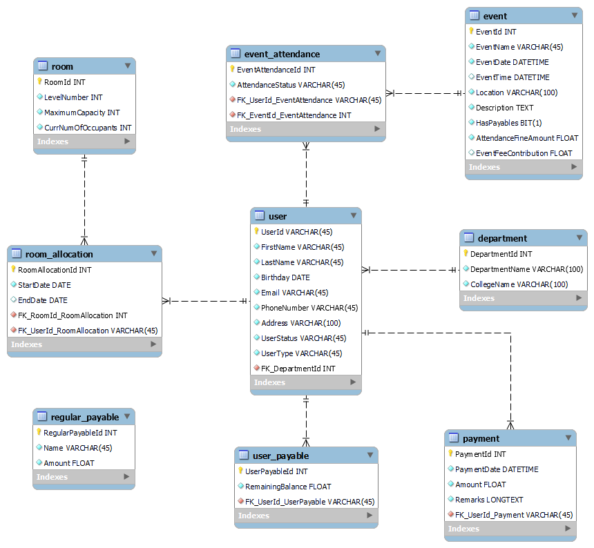

# Mabolo Dormitory Management System

- This project is a requirement for two courses within my *BS in Computer Science* program.
- The **Mabolo Dormitory Management System** is designed to streamline dormitory activities, including *room allocation*, *dormer information management*, *payments*, and other related events.
- It offers a *systemized* and **secured** approach to data storage, enhancing the overall **efficiency** of dormitory management.
- This system is tailored specifically for **admin users**, which may include the Dorm Adviser, Assistant Dorm Adviser, or Student Assistants.

## Features of the System

### Sign In Page

- This page manages the *login feature* of the system. It serves as the initial interface upon opening the application.

### Dashboard Page

- The Dashboard provides an overview of the current dormitory status, displaying a summary of significant information necessary for efficient management, including *dorm user count*, *room count*, *payment collectibles*, and events.
- Additionally, this page showcases dormitory and developer information.

### Dormers Page

- The Dormers page presents the current list of dormitory occupants, offering filtering options by user type, search functionality, and pagination for display management.
- Admin users can also utilize this page to add new dormers to the system.

### Rooms Page

- This page displays the different users per room. The admin can allocate dormers to a room or move a dormer to a new room.

### Events Page

- The Events page showcases the events in the dormitory. Here, the admin can add new events, update existing ones, and delete events.
- This page also manages attendance for every event.

### Payments Page

- The Payments page displays the payables of every dormer, including their remaining balance. The admin can view payments and add payment transactions for each dormer.
- Regular payables and payment summaries can be viewed on this page.

### Settings Page

- The Settings page allows the admin to modify their account and password. It also supports changing profile pictures and relevant admin information.

## Database Model

- This ERD presents a model tailored for a **dormitory management system** which I used to offer a comprehensive view of its entities and relationships. Below is a breakdown of the entities and their attributes:

### Entities:

#### User:
- Represents individuals interacting with the system.
- Attributes include `UserId` (primary key), `FirstName`, `LastName`, `Email`, `PhoneNumber`, `Department`, `UserType`, and `UserStatus`.

#### Department:
- Stores department information for residents.
- Attributes consist of `DepartmentId` (primary key) and `DepartmentName`.

#### Room:
- Represents rooms within the dormitory.
- Attributes include `RoomId` (primary key), `LevelNumber`, `MaximumCapacity`, and `CurrNumOccupants`.

#### Payment:
- Tracks financial transactions made within the system.
- Attributes comprise `PaymentId` (primary key), `Amount`, `PaymentDate`, `PaymentType`, `Status`, and a foreign key referencing `UserId`.

#### Regular Payable:
- Represents ongoing or recurring fees.
- Attributes include `RegularPayableId` (primary key), `Name`, and `Amount`.

#### Event:
- Represents events taking place in the dormitory.
- Attributes consist of `EventId` (primary key), `EventName`, `EventDate`, `EventType`, and `Location`.

#### Room Allocation:
- Links users to rooms, indicating room assignments.
- Attributes include `RoomAllocationId` (primary key), `StartDate`, `EndDate`, and foreign keys referencing `RoomId` and `UserId`.

#### Event Attendance:
- Tracks attendance for events.
- Attributes comprise `EventAttendanceId` (primary key) and `AttendanceStatus`, with foreign keys referencing `EventId` and `UserId`.

#### User Payable:
- Links users to specific outstanding payments.
- Attributes include `UserPayableId` (primary key), with foreign keys referencing `UserId` and `RegularPayableId`.

### Relationships:

- A *User* can be assigned to a single *Department*.
- A *Room* can have many *Room Allocation* records, representing residents assigned over time.
- A *Room Allocation* record belongs to one *Room* and one *User*.
- A *User* can have many *Room Allocation* records, indicating different room assignments over time.
- A *User* can make many *Payment* records, with each *Payment* record associated with one *User*.
- An *Event* can have many *Event Attendance* records, indicating residents who attended.
- An *Event Attendance* record belongs to one *Event* and one *User*.
- A *User* can attend many *Events* through *Event Attendance* records.
- A *User* might have many *User Payable* records, representing outstanding payments for recurring fees.
- A *User Payable* record belongs to one *User* and one *Regular Payable* record.
