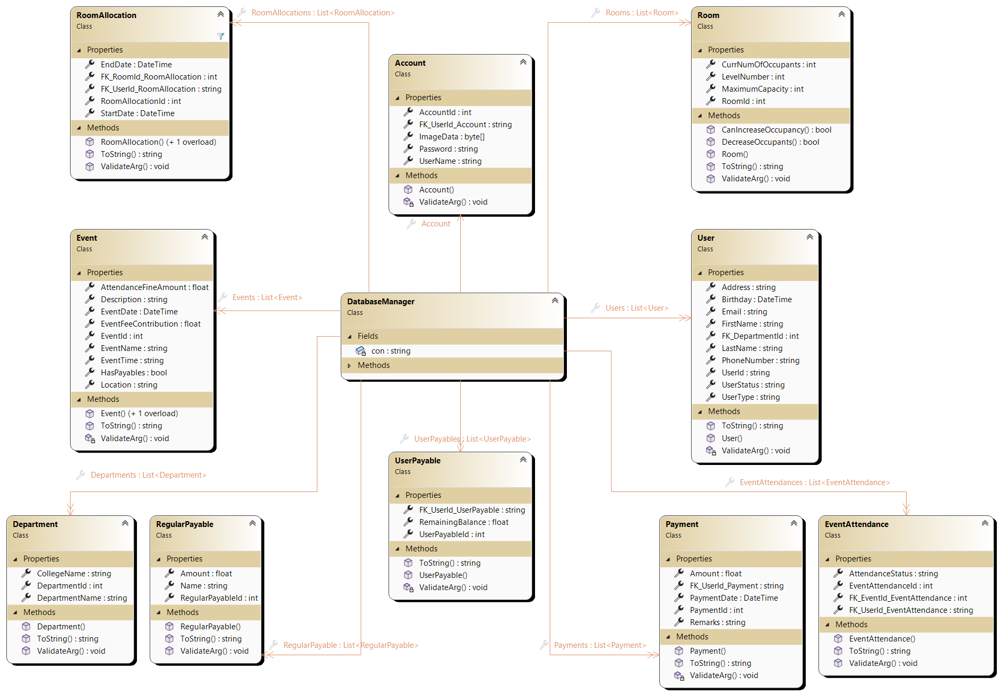

# Mabolo Dormitory Management System

- This project is a requirement for two courses within my *BS in Computer Science* program.
- The **Mabolo Dormitory Management System** is designed to streamline dormitory activities, including *room allocation*, *dormer information management*, *payments*, and other related events.
- It offers a *systemized* and **secured** approach to data storage, enhancing the overall **efficiency** of dormitory management.
- This system is tailored specifically for **admin users**, which may include the Dorm Adviser, Assistant Dorm Adviser, or Student Assistants.

## 📚 Table of Contents

- [Features of the System](#features-of-the-system)
  - [Sign In Page](#sign-in-page)
  - [Dashboard Page](#dashboard-page)
  - [Dormers Page](#dormers-page)
  - [Rooms Page](#rooms-page)
  - [Events Page](#events-page)
  - [Payments Page](#payments-page)
  - [Settings Page](#settings-page)
- [Database Model](#database-model)
  - [Entities](#entities)
    - [User](#user)
    - [Department](#department)
    - [Room](#room)
    - [Payment](#payment)
    - [Regular Payable](#regular-payable)
    - [Event](#event)
    - [Room Allocation](#room-allocation)
    - [Event Attendance](#event-attendance)
    - [User Payable](#user-payable)
  - [Relationships](#relationships)
- [Events Documentation](#events-documentation)
- [Class Diagram](#class-diagram)
- [How to Use the App?](#🚀-how-to-use-the-app)
  - [Prerequisite](#prerequisite)
    - [MySql Server](#🛠-mysql-server)
    - [Download Resources](#📥-download-resources)
  - [Set Up MySql](#set-up-mysql)
  - [Set Up Environment Variables](#set-up-environment-variables)
  - [Install](#install)
- [How to Open Using Visual Studio?](#🖥-how-to-open-using-visual-studio)
- [License Information](#license-information)
- [Contributing](#contributing)
- [Demo](#demo)
- [Contact Information](#contact-information)
- [Acknowledgements](#acknowledgements)
- [Developer Credits](#developer-credits)

## Features of the System

### Sign In Page

- This page manages the *login feature* of the system. It serves as the initial interface upon opening the application.

### Dashboard Page

- The Dashboard provides an overview of the current dormitory status, displaying a summary of significant information necessary for efficient management, including *dorm user count*, *room count*, *payment collectibles*, and events.
- Additionally, this page showcases dormitory and developer information.

### Dormers Page

- The Dormers page presents the current list of dormitory occupants, offering filtering options by user type, search functionality, and pagination for display management.
- Admin users can also utilize this page to add new dormers to the system.

### Rooms Page

- This page displays the different users per room. The admin can allocate dormers to a room or move a dormer to a new room.

### Events Page

- The Events page showcases the events in the dormitory. Here, the admin can add new events, update existing ones, and delete events.
- This page also manages attendance for every event.

### Payments Page

- The Payments page displays the payables of every dormer, including their remaining balance. The admin can view payments and add payment transactions for each dormer.
- Regular payables and payment summaries can be viewed on this page.

### Settings Page

- The Settings page allows the admin to modify their account and password. It also supports changing profile pictures and relevant admin information.

## Use Case Diagram

- This use case diagram represent the **dormitory management system**.

## Database Model

- This ERD presents a model tailored for a **dormitory management system** which I used to offer a comprehensive view of its entities and relationships. Below is a breakdown of the entities and their attributes:

### Entities:

#### User:
- Represents individuals interacting with the system.
- Attributes include `UserId` (primary key), `FirstName`, `LastName`, `Email`, `PhoneNumber`, `Department`, `UserType`, and `UserStatus`.

#### Department:
- Stores department information for residents.
- Attributes consist of `DepartmentId` (primary key) and `DepartmentName`.

#### Room:
- Represents rooms within the dormitory.
- Attributes include `RoomId` (primary key), `LevelNumber`, `MaximumCapacity`, and `CurrNumOccupants`.

#### Payment:
- Tracks financial transactions made within the system.
- Attributes comprise `PaymentId` (primary key), `Amount`, `PaymentDate`, `PaymentType`, `Status`, and a foreign key referencing `UserId`.

#### Regular Payable:
- Represents ongoing or recurring fees.
- Attributes include `RegularPayableId` (primary key), `Name`, and `Amount`.

#### Event:
- Represents events taking place in the dormitory.
- Attributes consist of `EventId` (primary key), `EventName`, `EventDate`, `EventType`, and `Location`.

#### Room Allocation:
- Links users to rooms, indicating room assignments.
- Attributes include `RoomAllocationId` (primary key), `StartDate`, `EndDate`, and foreign keys referencing `RoomId` and `UserId`.

#### Event Attendance:
- Tracks attendance for events.
- Attributes comprise `EventAttendanceId` (primary key) and `AttendanceStatus`, with foreign keys referencing `EventId` and `UserId`.

#### User Payable:
- Links users to specific outstanding payments.
- Attributes include `UserPayableId` (primary key), with foreign keys referencing `UserId` and `RegularPayableId`.

### Relationships:

- A *User* can be assigned to a single *Department*.
- A *Room* can have many *Room Allocation* records, representing residents assigned over time.
- A *Room Allocation* record belongs to one *Room* and one *User*.
- A *User* can have many *Room Allocation* records, indicating different room assignments over time.
- A *User* can make many *Payment* records, with each *Payment* record associated with one *User*.
- An *Event* can have many *Event Attendance* records, indicating residents who attended.
- An *Event Attendance* record belongs to one *Event* and one *User*.
- A *User* can attend many *Events* through *Event Attendance* records.
- A *User* might have many *User Payable* records, representing outstanding payments for recurring fees.
- A *User Payable* record belongs to one *User*.

## Events Documentation

- This the first page of the events documentation embedded on this repository. To view the complete copy of the documentation, the PDF copy can be accessed in this directory: `Resources/Documentation-of-Events.pdf`.

## Class Diagram

- These were the classes used on developing this app. I have create a class named `DatabaseManager` that will execute all the queries from my GUI forms, for better effeciency and easy debugging. All the classes, excpeted the `DatabaseManager` has a corresponding test classes which were used for unit testing of the classes. 

## 🚀 How to Use the App?

### Prerequisite

#### 🛠 MySql Server

- You should have a **MySql community server**. If you don't have it, you can download it from the [official website](https://dev.mysql.com/downloads/mysql/). Follow the setup process and install it.

#### 📥 Download Resources

- Visit [this link](https://github.com/VSUrhuel/Mabolo-Dormitory-System/releases) to download the latest release version of this app. Click the `.msi` file to download it.

- Navigate to the `Resources` folder in this repository and download the SQL file `SystemDatabase`.

### Set Up MySql

- Open the MySql Workbench application. Click the plus icon next to the application's text logo.

- Enter the connection name and note the `hostname` and `username`.

- Click the database you created. Go to the `server` section, click `Data Import`, select `Import from Self-Contained file`, then choose the directory where the downloaded `SystemDatabase` is located. Finally, click `Start Import`.

- Congratulations! You have finished setting up MySql! Scroll down for more!

### Set Up Environment Variables

- In Windows search, look for `environment variables` settings. In `system variables`, click `add`.

- Add these three `variable names` individually: `MYSQL_PASSWORD`, `MYSQL_SERVER`, `MYSQL_USERNAME` (follow these names strictly), and set their values to the corresponding values you entered when setting up your database.

- If you forgot your server and username, you can view them by opening your database in workbench, clicking `server`, and going to `Manage Access Settings` > `Connection`.

- The variable value for `MYSQL_PASSWORD` is the password you entered when you first used MySql. You can view or change it by opening your database in workbench and navigating to `server` > `User and Privileges`.

### Install
- Run the installation process downloaded from [this GitHub link](https://github.com/VSUrhuel/Mabolo-Dormitory-System/releases/tag/System). **You can now use the app!**

## 🖥 How to Open Using Visual Studio?

- Click `code` at the top and select `Open with Visual Studio`.

- To fully utilize this, download various NutGet extensions, including but not limited to `MySql`, `Xunit`, and `MySql Connector`. These can be easily downloaded in NutGet Packages.

- For `GunaUI`, **DO NOT** download it from NutGet package. Manually download the `dll` file and add it to the project's references. You can download the `GunaUI.dll` from this repository.

## License Information

This project is licensed under the [MIT License](LICENSE), which means you are free to use, modify, and distribute the code as long as you include the original copyright notice and disclaimer. See the [LICENSE](LICENSE) file for more details.

## Contributing

Thank you for considering contributing to this project! Your contributions are greatly appreciated. Here are some ways you can contribute:

1. **Report Bugs**: If you encounter any bugs or issues, please [open an issue](https://github.com/yourusername/yourproject/issues) on GitHub.

2. **Suggest Features**: Have an idea for a new feature? [Open an issue](https://github.com/yourusername/yourproject/issues) and share your thoughts.

3. **Submit Pull Requests**: Fork the repository, make your changes, and submit a pull request for review.

4. **Provide Feedback**: Share your thoughts and suggestions in the project's [issues section](https://github.com/yourusername/yourproject/issues).

5. **Spread the Word**: Help others discover this project by sharing it on social media or with your peers.

Thank you for your interest and support! 🚀

## Demo

https://github.com/VSUrhuel/Mabolo-Dormitory-System/assets/114915612/cd5246cb-fec2-463d-8106-1e34f6c0089d

Here is the demo on how the application funcions. Additionally, screenshots showcasing the user interface and functionality are available in the [Screenshots](InterfacesDesigns/Dashboard.png) directory.

## Contact Information

For any questions, feedback, or support inquiries, feel free to contact me at:

- 
- 
- 

## Acknowledgements

I would like to acknowledge the following individuals for their contributions to this project:

- Sir [Jomari Barera](https://github.com/infinityweaver) and Ma'am Jonah Maaghop for their guidance and tips to become this project sucessfull.

## Developer Credits

This project is developed and maintained by:

**John Rhuel Laurente**  
*BS in Computer Science, 2nd Year*  
Visayas State University

---
